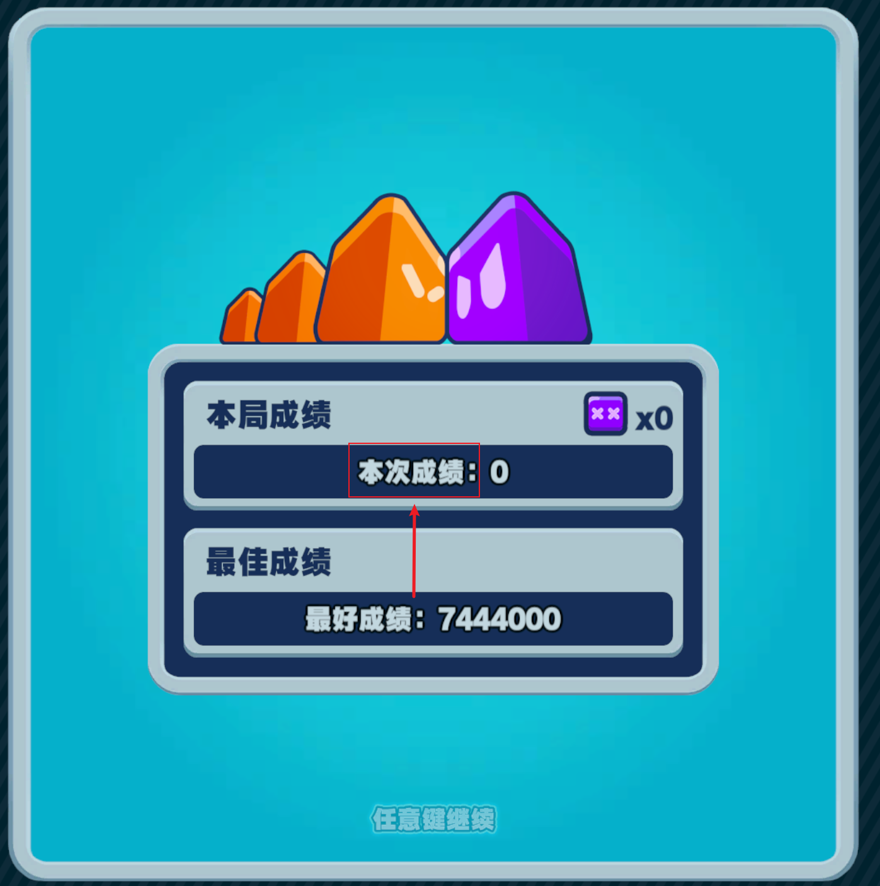

# 绝区零蛇对蛇全自动刷分脚本

此Python脚本通过模拟键盘输入来自动控制蛇进行刷分。脚本会让蛇以原地转圈的方式移动并在失败后自动重新开始，从而实现全自动刷分(很难刷到千万分以上).

## 安装方法

1. 安装库`pip install keyboard pyautogui`
2. 克隆存储库`git clone https://github.com/1492949083/ZenlessZoneZero-Snake.git`
4. 运行`python start.py`
5. 在蛇对蛇游戏中，按下 `F10` 键开始自动刷分(不用操控,脚本会自动将蛇移动到角落)。
6. 按下 `F11` 键暂停刷分。
7. Ctrl + C 退出

## 注意事项

- 运行此脚本时，请确保游戏窗口处于活动状态。
- 该脚本模拟键盘操作，因此在运行期间请勿手动干预蛇的移动，以避免冲突。

## 常见问题

- 如果游戏失败后不会自动重新开始，请将游戏结束界面此处截图并替换/img/image.png文件。

## 免责声明

此脚本仅供学习和娱乐使用，请勿用于破坏游戏平衡或其他不正当行为。使用此脚本的风险由用户自行承担。
