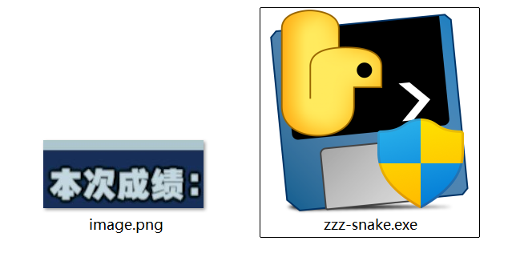

# 绝区零蛇对蛇全自动刷分脚本

通过模拟键盘输入来自动控制蛇进行刷分。让蛇以原地转圈的方式移动并在失败后自动重新开始，从而实现全自动刷分（很难刷到千万分以上）。

## 使用方法

1. [使用打包好的exe文件(应该没有python环境也能用))](https://github.com/1492949083/ZenlessZoneZero-Snake?tab=readme-ov-file#%E4%BD%BF%E7%94%A8%E6%89%93%E5%8C%85%E5%A5%BD%E7%9A%84-exe-%E6%96%87%E4%BB%B6 "a")
2. [使用源代码]()

### 使用打包好的 exe 文件

1. 从[Releases](https://github.com/1492949083/ZenlessZoneZero-Snake/releases/)下载打包好的 exe 文件。
2. 从蛇对蛇失败界面[此处](doc/img/1.png)截图取名 `image.png` 和 exe 文件放一起
3. 双击运行 exe 文件。
4. 在蛇对蛇游戏中，按下 `F10` 键开始自动刷分（脚本会自动将蛇移动到角落）。
5. 按下 `F11` 键暂停刷分。
6. 终端内按 `Ctrl + C` 退出。

### 使用源代码

1. 安装所需库：

   ```sh
   pip install -r requirements.txt
   ```
2. 克隆存储库：

   ```sh
   git clone https://github.com/1492949083/ZenlessZoneZero-Snake.git
   cd ZenlessZoneZero-Snake
   ```
3. 运行脚本：

   ```sh
   python start.py
   ```
4. 在蛇对蛇游戏中，按下 `F10` 键开始自动刷分（脚本会自动将蛇移动到角落）。
5. 按下 `F11` 键暂停刷分。
6. 终端内按 `Ctrl + C` 退出。

## 注意事项

- 运行此脚本时，请确保游戏窗口处于活动状态。
- 该脚本模拟键盘操作，因此在运行期间请勿手动干预蛇的移动，以避免冲突。

## 常见问题

- 如果游戏失败后不会自动重新开始，请将游戏结束界面[此处](doc/img/1.png)截图并替换 `image.png` 文件。

## 免责声明

此脚本仅供学习和娱乐使用，请勿用于破坏游戏平衡或其他不正当行为。使用此脚本的风险由用户自行承担。
